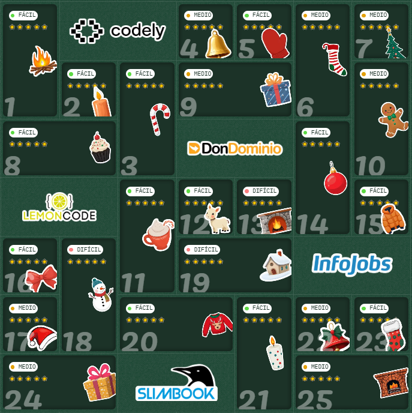
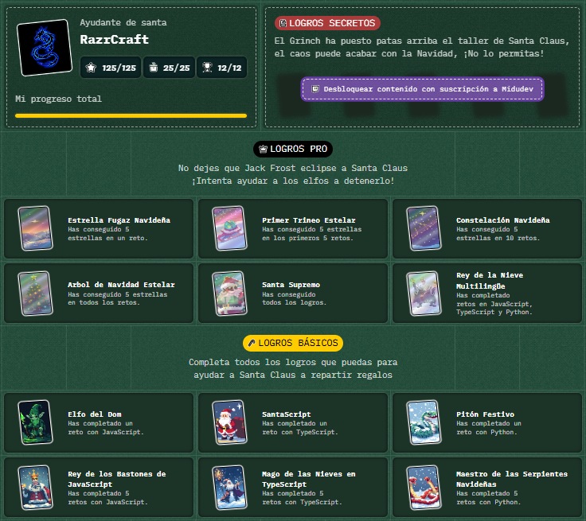

# AdventJS 2024

Estas son mis soluciones para el Advent.js de [@MiduDev](https://github.com/midudev "@MiduDev") en https://adventjs.dev/es.

  

<h3 align="center">🧑‍🚀 25 días de retos con JavaScript • <a href="https://adventjs.dev">AdventJS</a> 🚀</h3>

## 🕹️ Retos

|  #  |                  Reto                       |   Disponible    |                Solución                  |  Puntos  |  Nivel  |
| :-: | :------------------------------------------------------------------: | :------------:  | :----------------------------------------: | :---------: | :---------: |
| 01  |   🎁 ¡Primer regalo repartido!    |       ✅        | [JS](./JS/Reto%2301.js) / [Python](./Python/Reto%2301.py) |   5 ⭐   |    🟢    |  
| 02  |       🖼 Enmarcando nombres       |       ✅        | [JS](./JS/Reto%2302.js) / [Python](./Python/Reto%2302.py) |   5 ⭐   |    🟢    |  
| 03  |   🏗 Organizando el inventario    |       ✅        | [JS](./JS/Reto%2303.js) / [Python](./Python/Reto%2303.py) |   5 ⭐   |    🟢    |  
| 04  | 🎄 Decorando el árbol de Navidad  |       ✅        | [JS](./JS/Reto%2304.js) / [Python](./Python/Reto%2304.py) |   5 ⭐   |    🟠    |  
| 05  |       👞 Emparejando botas        |       ✅        | [JS](./JS/Reto%2305.js) / [Python](./Python/Reto%2305.py) |   5 ⭐   |    🟢    |  
| 06  |   📦 ¿Regalo dentro de la caja?   |       ✅        | [JS](./JS/Reto%2306.js) / [Python](./Python/Reto%2306.py) |   5 ⭐   |    🟠    |  
| 07  |      👹 El ataque del Grinch      |       ✅        | [JS](./JS/Reto%2307.js) / [Python](./Python/Reto%2307.py) |   5 ⭐   |    🟠    |  
| 08  |    🦌 La carrera de los renos     |       ✅        | [JS](./JS/Reto%2308.js) / [Python](./Python/Reto%2308.py) |   5 ⭐   |    🟢    |  
| 09  |        🚂 El tren mágico          |       ✅        | [JS](./JS/Reto%2309.js) / [Python](./Python/Reto%2309.py) |   5 ⭐   |    🟠    |  
| 10  |    👩‍💻 El ensamblador élfico       |       ✅        | [JS](./JS/Reto%2310.js) / [Python](./Python/Reto%2310.py) |   5 ⭐   |    🟠    |  
| 11  |🏴‍☠️ Nombres de archivos codificados |       ✅        | [JS](./JS/Reto%2311.js) / [Python](./Python/Reto%2311.py) |   5 ⭐   |    🟢    |  
| 12  |   💵 ¿Cuánto cuesta el árbol?     |       ✅        | [JS](./JS/Reto%2312.js) / [Python](./Python/Reto%2312.py) |   5 ⭐   |    🟢    |  
| 13  |   🤖 ¿El robot está de vuelta?    |       ✅        | [JS](./JS/Reto%2313.js) / [Python](./Python/Reto%2313.py) |   5 ⭐   |    🔴    |  
| 14  |     🦌 Acomodando los renos       |       ✅        | [JS](./JS/Reto%2314.js) / [Python](./Python/Reto%2314.py) |   5 ⭐   |    🟢    |  
| 15  |       ✏️ Dibujando tablas         |       ✅        | [JS](./JS/Reto%2315.js) / [Python](./Python/Reto%2315.py) |   5 ⭐   |    🟢    |  
| 16  | ❄️ Limpiando la nieve del camino  |       ✅        | [JS](./JS/Reto%2316.js) / [Python](./Python/Reto%2316.py) |   5 ⭐   |    🟢    |  
| 17  |  💣 Busca las bombas del Grinch   |       ✅        | [JS](./JS/Reto%2317.js) / [Python](./Python/Reto%2317.py) |   5 ⭐   |    🟠    |  
| 18  |   📇 La agenda mágica de Santa    |       ✅        | [JS](./JS/Reto%2318.js) / [Python](./Python/Reto%2318.py) |   5 ⭐   |    🔴    |  
| 19  | 📦 Apila cajas mágicas para repartir regalos |       ✅        | [JS](./JS/Reto%2319.js) / [Python](./Python/Reto%2319.py) |   5 ⭐   |    🔴    |  
| 20  | 🎁 Encuentra los regalos faltantes y duplicados |       ✅        | [JS](./JS/Reto%2320.js) / [Python](./Python/Reto%2320.py) |   5 ⭐   |    🟢    |  
| 21  | 🎄 Calcula la altura del árbol de Navidad |       ✅        | [JS](./JS/Reto%2321.js) / [Python](./Python/Reto%2321.py) |   5 ⭐   |    🟢    |  
| 22  | 🎁 Genera combinaciones de regalos |       ✅        | [JS](./JS/Reto%2322.js) / [Python](./Python/Reto%2322.py) |   5 ⭐   |    🟠    |  
| 23  | 🔢 Encuentra los números perdidos |       ✅        | [JS](./JS/Reto%2323.js) / [Python](./Python/Reto%2323.py) |   5 ⭐   |    🟢    |  
| 24  | 🪞 Verifica si los árboles son espejos mágicos |       ✅        | [JS](./JS/Reto%2324.js) / [Python](./Python/Reto%2324.py) |   5 ⭐   |    🟠    |  
| 25  |   🪄 Ejecuta el lenguaje mágico   |       ✅        | [JS](./JS/Reto%2325.js) / [Python](./Python/Reto%2325.py) |   5 ⭐   |    🟠    |  
| 26  | 🎯 Calcula el porcentaje completado |       ✅        | [JS](./JS/Reto%2326.js) / [Python](./Python/Reto%2326.py) |   5 ⭐   |    🟢    |  

### Todos los retos completados

 
  

### Todos los logros obtenidos

 
  

